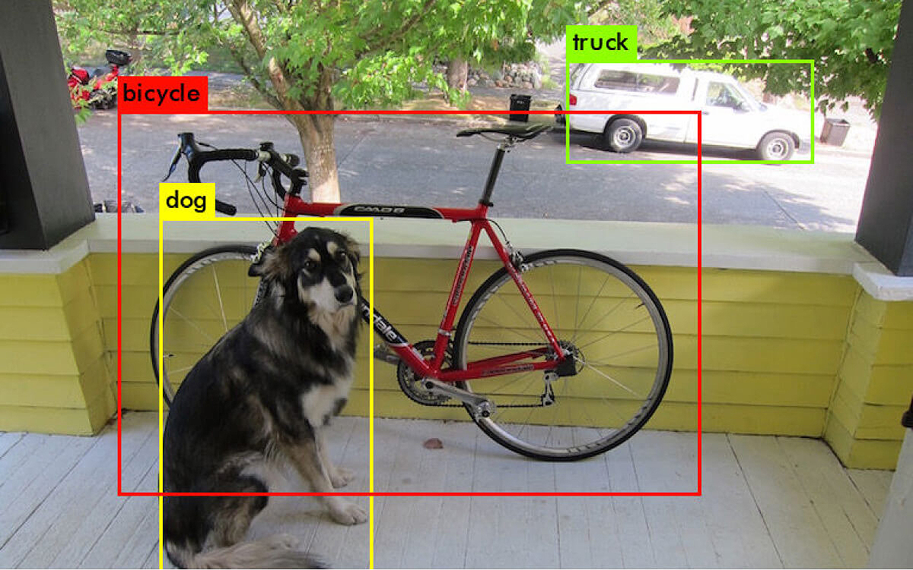

<h1> Hey! Nice to see you.</h1>

  

    
Welcome to my page!

    
I'm Felipe, Fullstack developer from <b>Sergipe, Brazil</b> 

    
Currently learning Computer Vision 🐍

  

  
 
    
  

<h3>Things I code with</h3>

   
  
  
  
  
  
  
  
  
  
  
  
  

<h3>My best projects</h3>
<table>
    <tr border: none;>
      <td><b>🎁 Projects</b></td>
      <td><b>⭐ Stars</b></td>
      <td><b>📚 Forks</b></td>
      <td><b>🛎 Issues</b></td>
      <td><b>📬 Pull requests</b></td>
    </tr>
  </thead>
  <tbody>
    <tr>
      <td><a href="https://github.com/felipequentino/PIBITI2023"><b>Environmental crime reporting portal</b></a></td>
      <td></td>
      <td></td>
      <td></td>
      <td></td>
    </tr>
	  <tr>
      <td><a href="https://github.com/felipequentino/soul_trap_skyrim"><b>Automation to evolve your character in Skyrim</b></a></td>
      <td></td>
      <td></td>
      <td></td>
      <td></td>
    </tr>
    <tr>
      <td><a href="https://github.com/felipequentino/machine-learning"><b>Code collection off Machine Learning</b></a></td>
      <td></td>
      <td></td>
      <td></td>
      <td></td>
    </tr>
  </tbody>
</table>
<h3>Where to find me</h3>

  

